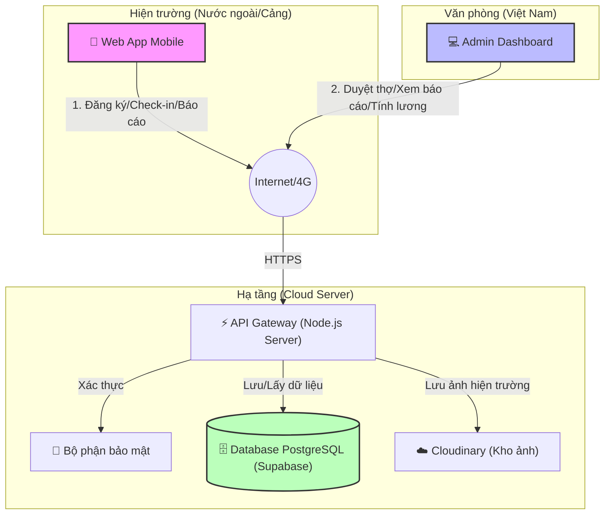

# 🏗️ SƠ ĐỒ KIẾN TRÚC HỆ THỐNG (SYSTEM ARCHITECTURE)

Dưới đây là luồng dữ liệu của dự án Quản Lý Thợ, sử dụng công nghệ Node.js và Supabase.

```mermaid
graph TD
    subgraph "Hiện trường (Nước ngoài/Cảng)"
        ClientApp["📱 Web App Mobile"] -->|"1. Đăng ký/Check-in/Báo cáo"| Internet(("Internet/4G"))
    end

    subgraph "Văn phòng (Việt Nam)"
        AdminDash["💻 Admin Dashboard"] -->|"2. Duyệt thợ/Xem báo cáo/Tính lương"| Internet
    end

    subgraph "Hạ tầng (Cloud Server)"
        Internet -->|HTTPS| API["⚡ API Gateway (Node.js Server)"]
        API -->|Xác thực| Auth["🔐 Bộ phận bảo mật"]
        API -->|"Lưu/Lấy dữ liệu"| DB[("🗄️ Database PostgreSQL (Supabase)")]
        API -->|"Lưu ảnh hiện trường"| Cloud["☁️ Cloudinary (Kho ảnh)"]
    end

    style ClientApp fill:#f9f,stroke:#333,stroke-width:2px
    style AdminDash fill:#bbf,stroke:#333,stroke-width:2px
    style DB fill:#bfb,stroke:#333,stroke-width:2px
```